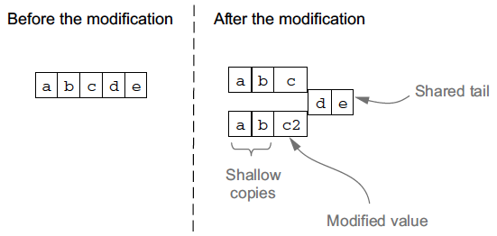
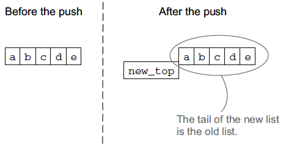

# Elixir in action

<!-- TOC depthFrom:1 depthTo:6 withLinks:1 updateOnSave:1 orderedList:0 -->

- [Elixir in action](#elixir-in-action)
	- [Chapter 2](#chapter-2)
		- [2.1 REPL](#21-repl)
		- [2.2 Variables](#22-variables)
		- [2.3 Organizing Code](#23-organizing-code)
			- [2.3.1 Modules](#231-modules)
			- [2.3.2 Functions](#232-functions)
			- [2.3.3 Functional Arity](#233-functional-arity)
			- [2.3.4 Function Visibility](#234-function-visibility)
			- [2.3.5 Imports and Aliases](#235-imports-and-aliases)
			- [2.3.6 Module Attributes](#236-module-attributes)
			- [2.3.7 Comments](#237-comments)
		- [2.4 Type System](#24-type-system)
			- [2.4.1 Numbers](#241-numbers)
			- [2.4.2 Atoms](#242-atoms)
				- [Aliases](#aliases)
				- [Atoms as booleans](#atoms-as-booleans)
				- [Nil and truthy values](#nil-and-truthy-values)
			- [2.4.3 Tuples](#243-tuples)
			- [2.4.4 Lists](#244-lists)
				- [Recursive list definition](#recursive-list-definition)
			- [2.4.5 Immutability](#245-immutability)
				- [Benefits](#benefits)
			- [2.4.6 Maps](#246-maps)
			- [2.4.7 Binaries and bitstrings](#247-binaries-and-bitstrings)
			- [2.4.8 Strings](#248-strings)
			- [2.4.9 First-class functions](#249-first-class-functions)
			- [2.4.10 Other built-in types](#2410-other-built-in-types)
			- [2.4.11 Higher-level types](#2411-higher-level-types)
				- [Range](#range)

<!-- /TOC -->

## Chapter 2

### 2.1 REPL

  + Running - `iex`
  + Exiting - `Ctrl + c` or clean closing - `System.halt`
  + Help - `h`, ex. `h IEx`
  + clear the console - `clear`

### 2.2 Variables

  + Naming convention - snake case (ex - variable_name). Variable names allowed to end with ? and !.
  + `=` is a bind operator and not assignment operator. Rebinding a variable to different value is allowed.

### 2.3 Organizing Code

#### 2.3.1 Modules

  + Outputting to console - `IO.puts`
  + Accepting input from console - `IO.gets "Votre nom? "`
  + Defining a module -

  ```elixir
  defmodule Geometry do
    def rectangle_area(a, b) do
      a * b
    end
  end
  ```

  + Interpreting and running the above code in iex

  ```sh
  $ iex geometry.ex
  iex(1)> Geometry.rectangle_area(6, 7)
  42
  ```

  + Module must be defined in single file. A single file can contain multiple modules.
  + Module names must start with uppercase character. Convention Pascalcase (Camelcase starting with uppercase).
  + Modules can be nested.

#### 2.3.2 Functions

  + Naming convention - snake case. Functions that return boolean end with **?**, functions that raise runtime errors end with **!**.
  + Function definition

  ```elixir
  defmodule Geometry do
    def rectangle_area(a, b) do
      ...
    end

    def run do # functions without parameters can omit parentheses.
      rectangle_area(2, 3) # Module name can be omitted if calling in the same module.
    end

    def rectangle_area(a, b), do: a * b # Condensed form
  end
  ```

  > *defmodule* and *def* are not keywords but macros.
  + Parentheses are optional while invoking functions, but always include them for the sake of clarity.
  + **Pipeline operator** - `-5 |> abs |> Integer.to_string |> IO.puts`.
  This code is transformed at runtime into - `IO.puts(Integer.to_string(abs(-5)))`.

  More generally, the pipeline operator places the result of the previous call as the first
  argument of the next call. So the following code `prev(arg1, arg2) |> next(arg3, arg4)` is translated at compile time to `next(prev(arg1, arg2), arg3, arg4)`.

#### 2.3.3 Functional Arity

  + Functional arity is number of arguments a function receives. Two functions with same name but different arities are different functions. It usually makes no sense for different functions with a same name to have completely different implementations. More commonly, a lower-arity function delegates to a higher-arity function, providing some default arguments.
  + Default arguments - provided by using `\\` operator followed by default value.

  ```elixir
  defmodule Calculator do
    def sum(a, b \\ 0) do
      a + b
    end
  end
  ```

  > Note that default values generate multiple functions of the same name with different arities.
  > So the previous code generates two functions: `Calculator.sum/1` and `Calculator.sum/2`.

#### 2.3.4 Function Visibility

  ```elixir
  defmodule TestPrivate do
    def double(a) do # public function
      sum(a, a)
    end

    defp sum(a, b) do # private function
      a + b
    end
  end
  ```

#### 2.3.5 Imports and Aliases

  ```elixir
  defmodule MyModule do
    import IO # import IO module

    def my_function do
      puts "Calling imported function." # Use puts from IO modules without module name.
    end
  end
  ```

  > The standard library's `Kernel` module is automatically imported into every module.

  + alias

  ```elixir
    defmodule MyModule do
      alias IO, as: MyIO # import IO as MyIO

      def my_function do
        MyIO.puts("Calling imported function.") # use MyIO as qualifier
      end
    end
  ```

#### 2.3.6 Module Attributes

  Used for two purposes
    1. **Compile-time constants** - inlined after compilation, doesn't exist at runtime.
    2. **Registered attributes** - Available at runtime and can be accessed at runtime by tools like  IEx, ex_doc and dializer.

  ```elixir
  defmodule Circle do
    # @moduledoc, @doc and @spec are registered by default by elixir. User can register his attributes too.
    @moduledoc "Implements basic circle functions"

    @pi 3.14159 # User defined attribute

    @doc "Computes the area of a circle"
    @spec area(number) :: number
    def area(r), do: r*r*@pi

    @doc "Computes the circumference of a circle"
    @spec circumference(number) :: number
    def circumference(r), do: 2*r*@pi
  end
  ```

#### 2.3.7 Comments

  Only one type of comment - `#`.

### 2.4 Type System

#### 2.4.1 Numbers

  ```sh
  iex(1)> 3 # integer
  3
  iex(2)> 0xFF # integer in hex
  255
  iex(3)> 3.14 # float
  3.14
  iex(4)> 1.0e-2 # float in exponential notation
  0.01
  iex(5)> 1 + 2 * 3 # usual arithmatic operator
  7
  iex(6)> 4/2 # division always retuns a float value
  2.0
  iex(8)> div(5,2) # integer division
  2
  iex(9)> rem(5,2) # calculation of remainder
  1
  iex(10)> 1_000_000 # Syntactic sugar - _ as visual delimiter
  1000000
  iex(11)> 999999999999999999999999999999999999999999999999999999999999999999999999999999999999999999999999999999999999999999999999 # no upper limit on interger size
  ```

#### 2.4.2 Atoms

  + Literal named constants like symbols in Ruby. Start with colon, followed by combination of alphanumerics and/or underscore.

  ```elixir
  :an_atom
  :another_atom
  :"an atom with spaces"
  ```

  + An atom consists of two parts
    1. *text* - everything after `:`. At runtime, this goes into an *atom table*.
    2. *value* - The data that goes into the variable, merely a reference to the atom table.

##### Aliases

  There is another syntax for atom - drop the starting colon and start with uppercase - `AnAtom`. This gets transformed to `Elixir.AnAtom` at compile time.
  The compiler implicitly adds *Elixir.* prefix if already not present.

  ```elixir
  iex(1)> AnAtom == :"Elixir.AnAtom"
  true

  iex(2)> AnAtom == Elixir.AnAtom
  true
  ```

  We have already seen another use earlier - giving alternative names to modules.

  ```elixir
  iex(3)> alias IO, as: MyIO
  iex(4)> MyIO.puts("Hello!")
  Hello!
  iex(5)> MyIO == Elixir.IO ## compiler emits :Elixir.IO for MyIO in the compiled binary.
  true
  ```

##### Atoms as booleans

  + Elixir doesn't have a dedicated boolean type. Instead, the atoms `:true` and `:false` are used.
  + As syntactic sugar, Elixir allows you to reference these atoms without the starting colon character.
  + The standard logical operators work with boolean atoms.

  ```elixir
  iex(1)> :true == true
  true
  iex(2)> :false == false
  true
  iex(1)> true and false
  false
  iex(2)> false or true
  true
  iex(3)> not false
  true
  iex(4)> not :an_atom_other_than_true_or_false
  ** (ArgumentError) argument error
  ```

##### Nil and truthy values

  + `:nil` atom whose functionality is similar to *null* from other languages.

  ```elixir
  iex(1)> nil == :nil
  true
  ```
  + The atoms `nil` and `false` are treated as *falsy* and everything else as *truthy*.
  + Works with *short-circuit* operators ||, && and !.

  ```elixir
  iex(1)> nil || false || 5 || true # || returns first value that isn't falsy.
  5
  iex(1)> true && 5 # && returns second expression only if first is truthy.
  5
  iex(2)> false && 5 # Otherwise returns first without evaluating second.
  false
  iex(3)> nil && 5
  nil
  ```

#### 2.4.3 Tuples

  Used to group fixed number of elements together.

  ```elixir
  iex(1)> person = {"Bob", 25} # a tuple with two elements, name and age
  {"Bob", 25}

  \# To extract element use Kernel.elem/2 function that accepts a tuple and zero-based index
  iex(2)> age = elem(person, 1)
  25

  \# To modify tuple, use Kernel.put_elem/3 function. NOTE: all values are immutable, the put_element
  \# call returns a new version of tuple that must be assigned.
  iex(3)> older_person = put_elem(person, 1, 26)
  {"Bob", 26}
  ```

#### 2.4.4 Lists

  + Dynamic variable-sized collection of data.
  + Work like singly linked list. Most of the operations are O(n) complexity except adding element at the beginning which is O(1).
  + `Enum` module can be used on lists.

  ```elixir
  iex(1)> prime_numbers = [1, 2, 3, 5, 7] # creating list
  [1, 2, 3, 5, 7]

  iex(2)> length(prime_numbers) # Kernel.length/1 function to find length
  5

  iex(3)> Enum.at(prime_numbers, 4) # get element - as usual 0-based index
  7

  iex(4)> 5 in prime_numbers # check if list contains an element
  true

  iex(5)> 4 in prime_numbers
  false

  iex(8)> prime_numbers = List.replace_at(prime_numbers, 0, 11) # replace element, note a new collection is returned
  [11, 2, 3, 5, 7]

  iex(9)> List.insert_at(prime_numbers, 4, 1) # insert at position
  [11, 2, 3, 5, 1, 7]

  iex(10)> List.insert_at(prime_numbers, -1, 1) # append, -1 indicates append at end
  [11, 2, 3, 5, 7, 1]

  iex(11)> [1,2,3] ++ [4,5] # list concatenation
  [1, 2, 3, 4, 5]
  ```

##### Recursive list definition

  + List can be viewed as recursive structure - a pair of (*head*, *tail*) - where *head* is the first elemtn and *tail* points to (*head*, *tail*) pair of remaining elements.
  + Elixir has special syntax to support recursive list definitions - `a_list = [head | tail]`

  ```elixir
  iex(1)> [1 | []]
  [1]
  iex(2)> [1 | [2 | []]]
  [1, 2]
  iex(3)> [1 | [2]]
  [1, 2]
  iex(4)> [1 | [2, 3, 4]]
  [1, 2, 3, 4]
  iex(1)> [1 | [2 | [3 | [4 | []]]]]
  [1, 2, 3, 4]
  iex(1)> hd([1, 2, 3, 4]) # getting head of the list
  1
  iex(2)> tl([1, 2, 3, 4]) # getting tail of the list
  [2, 3, 4]
  ```

  + `hd` and `tl` both are O(1). It's simple and efficient to push new element to the top of the list.

  ```elixir
  iex(1)> a_list = [5, :value, true]
  [5, :value, true]
  iex(2)> new_list = [:new_element | a_list]
  [:new_element, 5, :value, true]
  ```

#### 2.4.5 Immutability

  The default immutability of the elixir data allows memory sharing and efficiency.

  For example -
  1. *Modifying a list* - when n<sup>th</sup> is modified, the new version will contain shallow copies of the first *n - 1* elements, followed by modified element and tail is completed shared as shown in the below image -

  

  2. *Pushing element at the top of the list* - it doesn't copy anything so it's a least expensive operation.

  

  >This is often used in Elixir programs when iteratively building lists. In such cases, it’s best to push consecutive elements to the top and then,after the list is constructed, reverse the entire list in a single pass

##### Benefits

  1. Side-effect free Functions
  2. Data consistency

  The above two points allow us to do something like atomic in-memory operations. For example -

  ```elixir
  def complex_transformation(original_data) do
    original_data
    |> transformation_1(...)
    |> transformation_2(...)
    ...
  end
  ```

  If something goes wrong in any of the two steps, `complex_transformation` can simply return `original_data` thereby reverting changes.

#### 2.4.6 Maps

  + New data type added in Erlang 17.
  + In the current version, doesn't perform well with large number of elements. Use `hashDict` for such usage.
  + Maps are appropriate when you want to combine a few fields into a single structure. This use case is similar to tuple but it provides the advantage of field access by name.

  ```elixir
  iex(1)> bob = %{:name => "Bob", :age => 25, :works_at => "Initech"}
  %{age: 25, name: "Bob", works_at: "Initech"}

  iex(2)> bob = %{name: "Bob", age: 25, works_at: "Initech"} # if keys are atoms use this shortcut syntax
  %{age: 25, name: "Bob", works_at: "Initech"}

  iex(3)> bob[:works_at] # retrieve a field
  "Initech"

  iex(4)> bob[:non_existent_field] # retrieve a non-existent field
  nil

  iex(5)> bob.age # if key is atom this special syntax can be used
  25

  iex(6)> bob.non_existent_field # but it fails for non-existent field
  ** (KeyError) key :non_existent_field not found

  iex(8)> %{bob | age: 26, works_at: "Initrode"} # changing attributes
  %{age: 26, name: "Bob", works_at: "Initrode"}

  iex(9)> Map.put(bob, :salary, 50000) # use Map module for map manipulations
  %{age: 25, name: "Bob", salary: 50000, works_at: "Initech"}

  iex(10)> Dict.put(bob, :salary, 50000) # or more general-purpose Dict module
  %{age: 25, name: "Bob", salary: 50000, works_at: "Initech"}
  ```

#### 2.4.7 Binaries and bitstrings

  + A binary is a chunk of bytes.
  + Created by enclosing the byte sequence between `<<` and `>>` operators.

  ```elixir
  iex(2)> <<256>> # value bigger than 255 is truncated to byte size
  <<0>>

  iex(3)> <<257>>
  <<1>>

  iex(4)> <<512>>
  <<0>>

  iex(5)> <<257::16>> # mentioning size
  <<1, 1>> # using 2 bytes both with value 1 because 257 = 00000001 00000001

  iex(6)> <<1::4, 15::4>> # size specifier need not be multiplier of 8
  <<31>> # resulting value is 1 byte and output is normalized to 31 (0001 1111)

  iex(7)> <<1::1, 0::1, 1::1>> # if total size is not multiplier of 8, its called bit-string
  <<5::size(3)>>

  iex(8)> <<1, 2>> <> <<3, 4>> # concatenate 2 binaries
  <<1, 2, 3, 4>>
  ```

#### 2.4.8 Strings

  Elixir doesn't have a dedicated string type. A string is represented by either a **binary** or a **list type**.

  1. Binary strings - the usual double-quotes syntax.

    ```elixir
    iex(1)> "This is a string"
    "This is a string"

    iex(2)> "Embedded expression: #{3 + 0.14}" # embedded expressions
    "Embedded expression: 3.14"

    iex(3)> "\r \n \" \\" # classical \ escaping works

    \# strings can be multi-line
    iex(4)> "
          This is
          a multiline string
          "

    iex(5)> ~s(This is also a string) #sigil
    "This is also a string"

    iex(6)> ~s("Do... or do not. There is no try." -Master Yoda) # sigils are useful to include quotes
    "\"Do... or do not. There is no try.\" -Master Yoda"

    iex(7)> ~S(Not interpolated #{3 + 0.14}) # uppercase sigil - doesn't interpolate or escape
    "Not interpolated \#{3 + 0.14}"
    iex(8)> ~S(Not escaped \n)
    "Not escaped \\n"

    \# heredocs
    iex(9)> """
    Heredoc must end on its own line """
    """
    "Heredoc must end on its own line \"\"\"\n"

    iex(10)> "String" <> " " <> "concatenation" # strings are binaries so can be concatenated with <>
    "String concatenation"
    ```

  2. Character lists - alternative way to represent strings using single-quotes, which is essentially a list of integers in which each element represents a single character.

    ```elixir
    iex(1)> 'ABC'
    'ABC'

    iex(2)> [65, 66, 67] # same as above i.e. a list of integers
    'ABC'

    iex(3)> 'Interpolation: #{3 + 0.14}' # interpolation
    'Interpolation: 3.14'

    iex(4)> ~c(Character list sigil) # character list sigil
    'Character list sigil'

    iex(5)> ~C(Unescaped sigil #{3 + 0.14})
    'Unescaped sigil \#{3 + 0.14}'

    iex(6)> '''
    Heredoc
    '''
    'Heredoc\n'
    ```

    Character lists are not compatible with binary strings. Prefer binary strings over character lists.

    ```elixir
    iex(7)> String.to_char_list("ABC") # converting binary string to character list
    'ABC'

    iex(8)> List.to_string('ABC') # converting character list to binary string
    "ABC"
    ```

#### 2.4.9 First-class functions

  ```elixir
  iex(1)> square = fn(x) -> # anonymous function or lambda
            x * x
          end

  iex(2)> square.(5) # calling a lambda using .
  25

  iex(5)> Enum.each(
            [1, 2, 3],
            fn(x) -> IO.puts(x) end
            )
  1
  2
  3

  iex(6)> Enum.each(
          [1, 2, 3],
          &IO.puts/1 # capture operator & - shortcut if the lambda is just calling IO/puts
          )

  iex(7)> lambda = fn(x, y, z) -> x * y + z end # this can be shortened

  iex(8)> lambda = &(&1 * &2 + &3) # to this

  iex(1)> outside_var = 5
  iex(2)> lambda = fn() -> IO.puts(outside_var) end # lambdas are closures
  iex(3)> outside_var = 6 # rebinding does not affect the closure
  iex(4)> lambda.()
  5
  ```

#### 2.4.10 Other built-in types

  + *reference* - almost unique piece of information in BEAM instance. Generated by calling `Kernel.make_ref/0. A reference will reoccur after approximately 2^82 calls. But if a BEAM instance is restarted, reference generation starts from the beginning.
  + *pid* - used to identify Erlang process.
  + *port identifier* - It’s a mechanism used in Erlang to talk to the outside world. File I/O or communication with  external programs are done through ports.

#### 2.4.11 Higher-level types

##### Range

  ```elixir
  iex(1)> range = 1..2

  iex(2)> 2 in range
  true

  iex(3)> -1 in range
  false

  iex(4)> Enum.each(
            1..3, # range is enumerable so Enum.each can iterate on it
            &IO.puts/1
            )
  1
  2
  3
  ```
